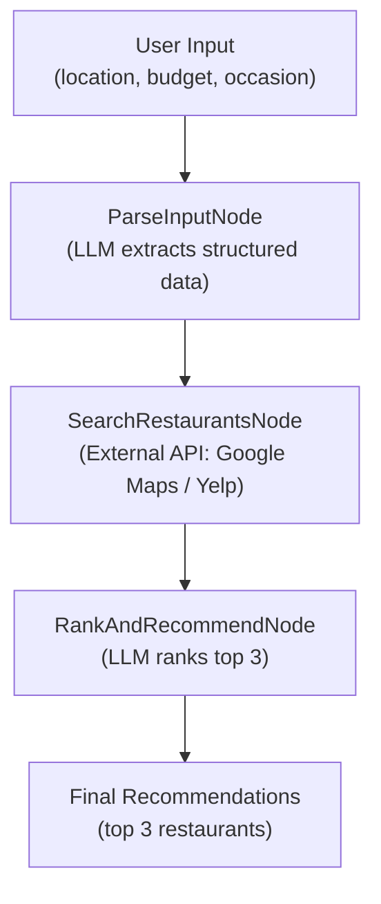

# Design Doc: Restaurant Suggestion Agent

> Please DON'T remove notes for AI

## Requirements

> Notes for AI: Keep it simple and clear.
> If the requirements are abstract, write concrete user stories

**User Story:** As a user, I want to provide my location, budget, and a description of the occasion (e.g., "romantic anniversary dinner", "kid-friendly brunch"), and receive the **top 3 restaurant recommendations** that best match my criteria.

**Concrete Requirements:**

1. The user provides free-text input containing location, budget, and occasion/taste description.
2. The system parses structured data (coordinates, price level, occasion tags) from the input.
3. The system searches for real restaurant candidates via an external API (Google Maps / Yelp).
4. The system ranks candidates against the user's occasion/taste description using an LLM.
5. The system returns the top 3 restaurants with names, addresses, ratings, and a brief reason for each pick.

**Guardrail:** The agent must **never hallucinate restaurant names**. It may only rank and recommend restaurants returned by the search utility.

---

## Flow Design

> Notes for AI:
> 1. Consider the design patterns of agent, map-reduce, rag, and workflow. Apply them if they fit.
> 2. Present a concise, high-level description of the workflow.

### Applicable Design Pattern:

**Workflow (Router-Worker)** — A linear three-node pipeline where each node has a single responsibility:

1. **Router (Parser):** Interprets the user's free-text input and routes structured data downstream.
2. **Worker 1 (Searcher):** Calls an external search API to fetch real restaurant candidates.
3. **Worker 2 (Ranker):** Uses the LLM to compare candidates against the user's taste/occasion and picks the top 3.

### Flow High-Level Design:

1. **ParseInputNode**: Extract structured data (lat/lng, price_level, occasion_tags) from the user's free-text query using the LLM.
2. **SearchRestaurantsNode**: Call the search utility with the parsed location and budget to retrieve real restaurant candidates.
3. **RankAndRecommendNode**: Use the LLM to score and rank candidates against the user's occasion description; return the top 3.



---

## Utility Functions

> Notes for AI:
> 1. Understand the utility function definition thoroughly by reviewing the doc.
> 2. Include only the necessary utility functions, based on nodes in the flow.

1. **Call LLM** (`utils/call_llm.py`)
   - *Input*: `prompt` (str)
   - *Output*: `response` (str)
   - *Necessity*: Used by **ParseInputNode** to extract structured data from free text, and by **RankAndRecommendNode** to score and rank candidates.

2. **Search Restaurants** (`utils/search_restaurants.py`)
   - *Input*: `lat` (float), `lng` (float), `price_level` (int, 1–4), `keyword` (str, optional)
   - *Output*: list of restaurant dicts, each containing `name`, `address`, `rating`, `price_level`, `description`, `reviews_snippet`
   - *Necessity*: Used by **SearchRestaurantsNode** to fetch real restaurant candidates from an external API. This is the single source of truth — the Ranker node must only use restaurants from this list.

---

## Node Design

### Shared Store

> Notes for AI: Try to minimize data redundancy

The shared store structure is organized as follows:

```python
shared = {
    # Raw user input
    "user_query": "",          # str — the original free-text input from the user

    # Parsed structured data (written by ParseInputNode)
    "location_data": {
        "lat": 0.0,            # float — latitude
        "lng": 0.0,            # float — longitude
        "address_text": ""     # str — human-readable location string
    },
    "price_level": 0,          # int (1-4) — 1=cheap, 4=luxury
    "occasion_tags": [],       # list[str] — e.g., ["romantic", "anniversary", "fine dining"]

    # Search results (written by SearchRestaurantsNode)
    "candidates_list": [],     # list[dict] — raw restaurant results from the search API
                               # Each dict: {name, address, rating, price_level, description, reviews_snippet}

    # Final output (written by RankAndRecommendNode)
    "final_recommendations": []  # list[dict] — top 3 picks
                                 # Each dict: {name, address, rating, reason}
}
```

### Node Steps

> Notes for AI: Carefully decide whether to use Batch/Async Node/Flow.

1. **ParseInputNode**
   - *Purpose*: Extract structured location, budget, and occasion data from the user's free-text query.
   - *Type*: Regular Node
   - *Steps*:
     - *prep*: Read `shared["user_query"]`
     - *exec*: Call `call_llm()` with a prompt that instructs the LLM to output YAML containing `lat`, `lng`, `address_text`, `price_level` (1–4), and `occasion_tags`. Parse and validate the YAML output.
     - *post*: Write parsed results to `shared["location_data"]`, `shared["price_level"]`, and `shared["occasion_tags"]`

2. **SearchRestaurantsNode**
   - *Purpose*: Fetch real restaurant candidates from an external search API based on parsed location and budget.
   - *Type*: Regular Node
   - *Steps*:
     - *prep*: Read `shared["location_data"]`, `shared["price_level"]`, and `shared["occasion_tags"]`
     - *exec*: Call `search_restaurants(lat, lng, price_level, keyword)` where keyword is derived from occasion_tags. No exception handling here — let the Node's retry mechanism manage failures.
     - *post*: Write the list of restaurant dicts to `shared["candidates_list"]`

3. **RankAndRecommendNode**
   - *Purpose*: Use the LLM to compare candidates against the user's occasion/taste description and select the top 3.
   - *Type*: Regular Node
   - *Steps*:
     - *prep*: Read `shared["user_query"]`, `shared["occasion_tags"]`, and `shared["candidates_list"]`
     - *exec*: Call `call_llm()` with a prompt that includes the full candidate list and the user's query/tags. Instruct the LLM to **only select from the provided candidates** (guardrail against hallucination). Parse the YAML output containing the top 3 picks with reasons.
     - *post*: Write the top 3 results to `shared["final_recommendations"]`

